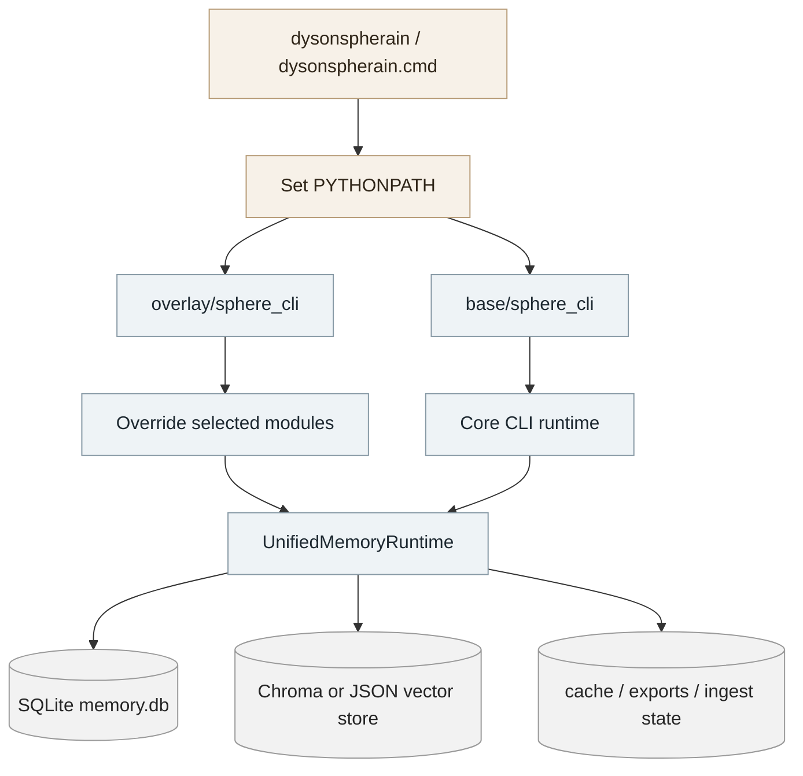
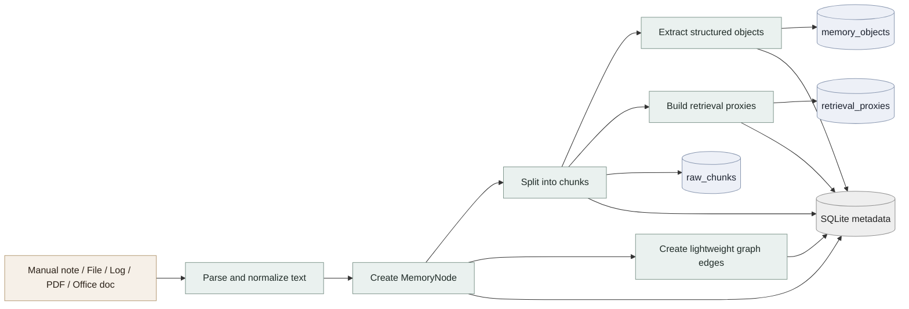
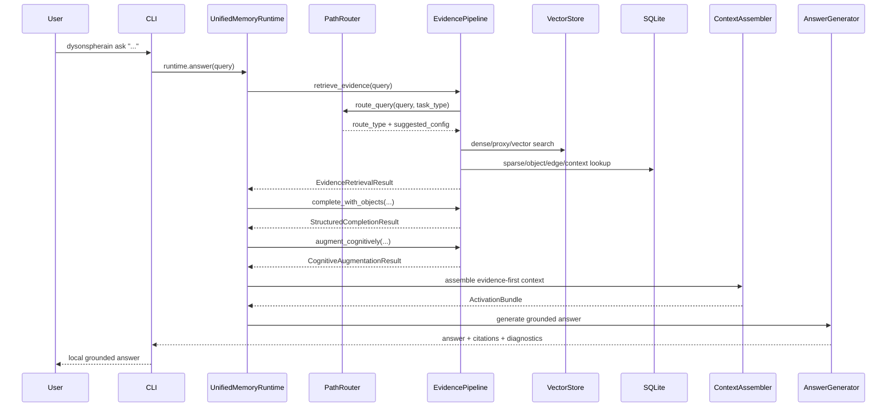
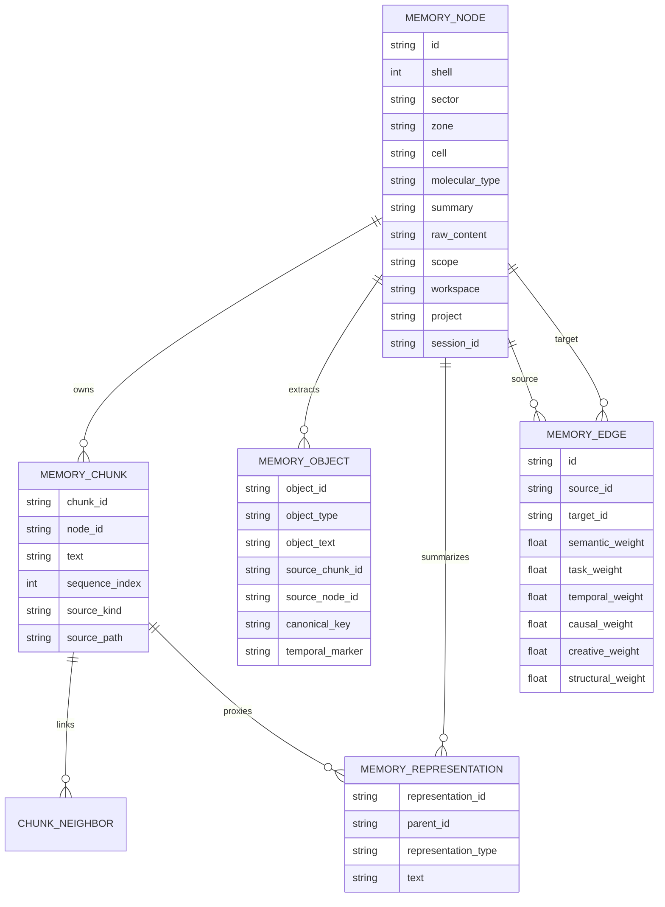
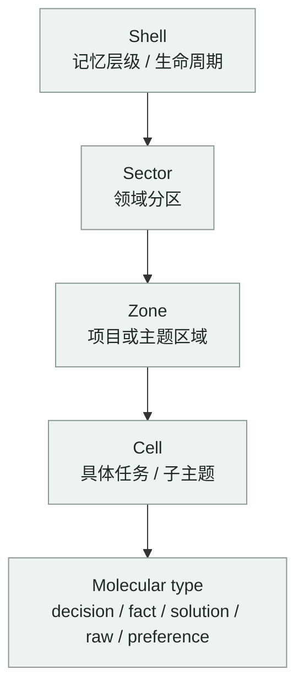
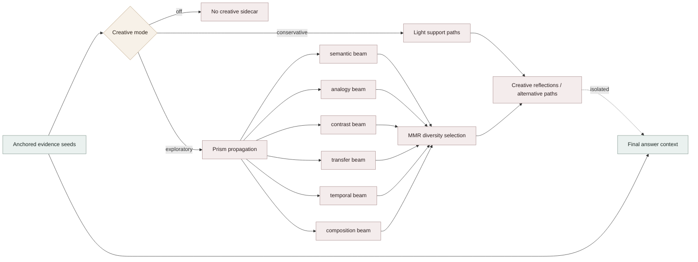
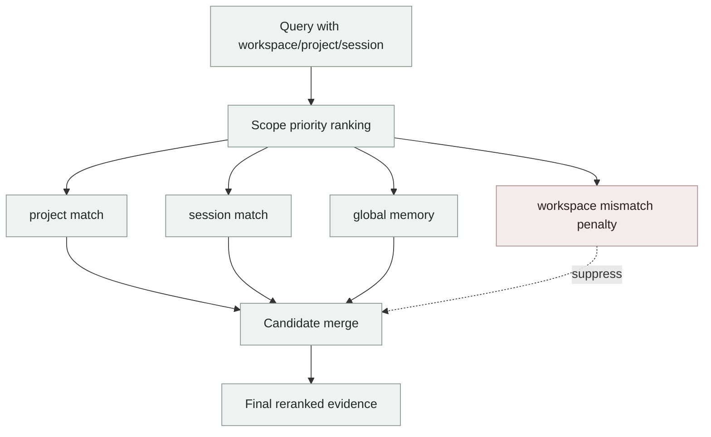
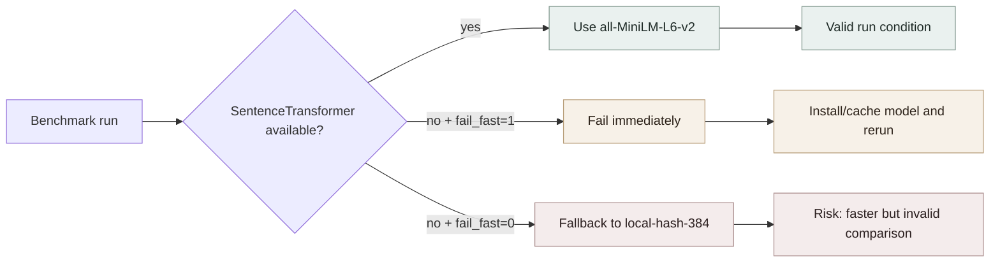
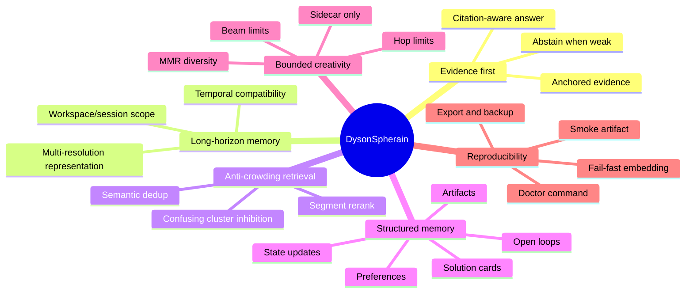

# DysonSpherain CLI

> Evidence-first local long-horizon memory CLI with temporal edge reranking, competition-aware inhibition, structured memory objects, graph writeback, and bounded creative expansion.

DysonSpherain CLI 是一个面向长期本地记忆、项目知识沉淀和 CLI 级问答检索的记忆系统。它把文档、代码、日志、人工笔记和 benchmark 数据写入本地数据库，构建多粒度记忆表示，并在查询时优先返回可引用证据，再进行结构化补全、图激活和可控创意扩展。

本交付包由三部分组成：

- `base/`：核心 CLI、存储、检索、写入、摄取、评测代码。
- `overlay/`：当前 DysonSpherain 覆盖层，用于覆盖同名模块中的路由、写回和 benchmark 调优逻辑。
- `quest_extras/`：额外 benchmark adapter、metric contract 和实验脚手架。

---

## 1. 项目定位

DysonSpherain 不是一个普通向量数据库 demo，而是一个**长期记忆操作系统雏形**。它重点解决长期 CLI 记忆检索中的两个问题：

1. **Temporal anchoring drift**：语义相似但时间点错误的记忆被排到前面。
2. **Local candidate crowding**：同一局部簇中的近重复候选占满 top-k，真正关键证据被挤出。

系统采用 evidence-first 策略：先检索和锚定证据，再补充结构对象、相关经验和创意侧链，避免创意内容污染事实证据。


---

## 2. 当前代码能力总览

| 能力 | 当前实现 |
|---|---|
| 本地数据存储 | SQLite 元数据 + Chroma/JSON 向量后端 |
| 向量索引 | `raw_chunks`、`memory_objects`、`retrieval_proxies` 三类集合 |
| 默认 embedding | `sentence-transformers/all-MiniLM-L6-v2`，不可用时可回退 `local-hash-384` |
| 回退护栏 | `SPHERE_EMBEDDING_FAIL_FAST=1` 可阻止 benchmark 中静默回退 |
| 文件摄取 | Markdown、txt、代码、log、PDF、docx、pptx、xlsx、html、json、yaml、toml 等 |
| 结构对象抽取 | preference、state_update、solution_card、artifact、open_loop、relation、temporal_reference 等 |
| 检索链路 | 任务路由、对象 shortcut、时间预过滤、dense/sparse/proxy 检索、segment rerank、confusing cluster rerank |
| 写回机制 | chunk、object、retrieval proxy、多分辨率表示、轻量图边、delta/去重写入 |
| 创意扩展 | `off` / `conservative` / `exploratory` 三档，作为 sidecar 输出 |
| 工作区上下文 | `workspace`、`project`、`session`、`scope`、`scope_order` |
| 可复现性 | `doctor`、`config profile`、`benchmark smoke-all`、测试与 smoke artifact |
| 数据治理 | `memory export`、`memory backup`、`memory forget` |

---

## 3. 目录结构

```text
dysonspherain-cli-direct-20260424/
├─ dysonspherain                  # Unix/macOS launcher
├─ dysonspherain.cmd              # Windows launcher
├─ requirements.txt               # 顶层依赖入口，引用 base/requirements.txt
├─ pyproject.toml                 # Python package metadata
├─ README.md                      # 原交付说明
├─ UPGRADE_NOTES_2026-04-24.md    # 本轮升级说明
├─ TEST_RESULTS_2026-04-24.txt    # 单测结果
├─ BENCHMARK_SMOKE_2026-04-24.json# smoke benchmark artifact
├─ sample_data/
│  └─ quickstart_notes.md
├─ tests/
│  └─ test_guardrails.py
├─ base/
│  ├─ README.md
│  ├─ requirements.txt
│  ├─ benchmarks/
│  │  ├─ longmemeval_benchmark.py
│  │  ├─ locomo_benchmark.py
│  │  ├─ knowme_benchmark.py
│  │  ├─ clonemem_benchmark.py
│  │  └─ run_all_benchmarks.py
│  └─ sphere_cli/
│     ├─ cli.py
│     ├─ runtime.py
│     ├─ config.py
│     ├─ storage.py
│     ├─ vector_store.py
│     ├─ embedding.py
│     ├─ ingestion.py
│     ├─ memory_writer.py
│     ├─ writeback.py
│     ├─ evidence_pipeline.py
│     ├─ path_router.py
│     ├─ context_assembler.py
│     ├─ prism_propagation_engine.py
│     ├─ answer_generator.py
│     └─ ...
├─ overlay/
│  ├─ run_external_benchmark_with_overlay.py
│  └─ sphere_cli/
│     ├─ path_router.py
│     ├─ benchmark_routes.py
│     ├─ memory_writer.py
│     └─ writeback.py
└─ quest_extras/
   ├─ experiments/main/
   │  ├─ epbench_adapter/
   │  ├─ halumem_adapter/
   │  └─ prefeval_adapter/
   └─ baselines/local/dysonspherain-memory-cli/
```

---

## 4. 交付包加载机制

启动脚本会自动设置：

```bash
PYTHONPATH=<repo>/overlay:<repo>/base
```

因此 Python 会优先加载 `overlay/sphere_cli/*` 中的同名模块，再回退到 `base/sphere_cli/*`。这使得主代码保持稳定，同时允许当前实验版本覆盖路由和写回策略。



---

## 5. 安装

### 5.1 macOS / Linux

```bash
cd dysonspherain-cli-direct-20260424
python3 -m venv .venv
source .venv/bin/activate
pip install -r requirements.txt
./dysonspherain init
./dysonspherain doctor --json
```

### 5.2 Windows PowerShell

```powershell
cd dysonspherain-cli-direct-20260424
python -m venv .venv
.\.venv\Scripts\Activate.ps1
pip install -r requirements.txt
.\dysonspherain.cmd init
.\dysonspherain.cmd doctor --json
```

### 5.3 最小离线 smoke 环境

如果暂时没有 Chroma 或 sentence-transformers，可以使用 JSON 向量后端：

```bash
export SPHERE_VECTOR_BACKEND=json
./dysonspherain init
./dysonspherain benchmark smoke-all
```

Windows PowerShell：

```powershell
$env:SPHERE_VECTOR_BACKEND = "json"
.\dysonspherain.cmd init
.\dysonspherain.cmd benchmark smoke-all
```

> 注意：JSON vector backend 适合干净环境、单测和 smoke test。较大规模记忆库仍建议安装并使用 Chroma。

---

## 6. 快速开始

### 6.1 查看状态

```bash
./dysonspherain status
./dysonspherain doctor --json
```

### 6.2 手动写入一条记忆

```bash
./dysonspherain remember add \
  --shell 1 \
  --sector project \
  --zone dysonspherain \
  --cell retrieval \
  --molecular-type decision \
  --summary "Use temporal edge reranking to reduce wrong-time memory drift." \
  --content "The retrieval pipeline should not rely on semantic similarity alone. Temporal compatibility and reachability must reweight candidates before final evidence assembly."
```

### 6.3 摄取一个目录

```bash
./dysonspherain ingest path ./sample_data --zone quickstart --sector project --shell 1
```

### 6.4 进行本地证据问答

```bash
./dysonspherain ask "What should fix wrong-time memory drift?"
```

输出由 `EvidenceAnswerGenerator` 生成。它不会伪装成 LLM，而是从已锚定证据中生成简洁回答，并返回 memory id / chunk id / object id 级引用。

### 6.5 查看检索链路

```bash
./dysonspherain memory trace \
  --task "Explain how DysonSpherain handles temporal drift and local crowding" \
  --task-type design
```

---

## 7. 写入与摄取流程

当你写入一条 memory note 或摄取文档时，系统会生成多层表示：

1. `MemoryNode`：记忆主节点，保存摘要、原文、shell/sector/zone/cell/molecular_type 等定位信息。
2. `memory_chunks`：文本切块，用于 raw evidence 检索。
3. `memory_objects`：偏好、状态、方案、事实、关系、open loop 等结构对象。
4. `memory_representations`：summary、structured、signature 等 retrieval proxy。
5. `memory_edges`：语义、任务、时间、因果、创意、结构等轻量图边。
6. Vector store：将 raw chunks、objects、proxies 分别写入对应向量集合。



---

## 8. 检索与回答流程

核心检索链路位于 `EvidencePipeline` 和 `UnifiedMemoryRuntime`。一次查询大致经过以下阶段：



检索管线中包含几个关键控制点：

| 控制点 | 目的 |
|---|---|
| Task router | 判断 query 是 exact factual、temporal、debug/design、persona/preference/state 还是 creative |
| Object shortcut | preference、state、relation、artifact、open_loop 等问题可以优先走结构对象 |
| Temporal prefilter | 对 latest、previous、before/after、具体日期等问题增强时间兼容性 |
| Segment rerank | 对候选文本片段进行更细粒度评分 |
| Confusing cluster rerank | 抑制局部近重复簇，减少 top-k 被同质候选占满 |
| Identity-aware rerank | 对人名、角色、关系等身份线索进行补充分数控制 |
| Context compressor | 控制最终上下文 token，保留核心证据优先级 |

---

## 9. 记忆数据模型

DysonSpherain 的记忆不是单一文本块，而是多表示并存。



五级索引的语义如下：



默认 shell policy：

| Shell | 名称 | 典型用途 | 压缩倾向 |
|---:|---|---|---|
| 0 | core | 高稳定核心知识 | very_high |
| 1 | active | 当前活跃项目和决策 | high |
| 2 | stable_knowledge | 稳定知识库 | medium |
| 3 | case_experience | 案例经验和调试记录 | low_medium |
| 4 | raw_material | 原始材料、日志、长文档 | minimal |

---

## 10. 创意扩展：Prism Propagation

创意引擎是后置 sidecar，不会替代核心证据。它只在 evidence-first 检索完成后，基于 top evidence seeds 做有界传播。



常用配置：

```bash
export SPHERE_CREATIVE_MODE=conservative      # off / conservative / exploratory
export SPHERE_CREATIVE_BEAM_WIDTH=6
export SPHERE_CREATIVE_MAX_HOPS=2
export SPHERE_CREATIVE_NEIGHBORS_PER_HOP=4
export SPHERE_CREATIVE_MAX_OUTPUT_PATHS=4
```

---

## 11. 工作区与作用域

CLI 支持把同一个本地记忆库分成不同 workspace、project、session 和 scope。查询时可以通过 scope priority 控制优先级。

```bash
./dysonspherain \
  --workspace lab \
  --project dysonspherain \
  --session paper-revision-20260424 \
  --mode deep \
  --scope-order project,session,global \
  ask "What was the latest retrieval design decision?"
```

作用域逻辑：



支持模式：

| Mode | 检索倾向 |
|---|---|
| `fast` | 降低 coarse/fine top-k，适合日常快速检索 |
| `balanced` | 默认平衡模式 |
| `deep` | 提高候选池和 rerank top-k，适合论文、debug、复杂设计 |

---

## 12. 常用命令清单

### 初始化与诊断

```bash
./dysonspherain init
./dysonspherain status
./dysonspherain doctor --json
```

### 写入记忆

```bash
./dysonspherain remember add --shell 1 --sector project --zone my_project --cell decision --molecular-type decision --summary "..." --content "..."
```

### 摄取文件

```bash
./dysonspherain ingest path ./docs --zone raw_docs
./dysonspherain ingest sync ./docs --zone raw_docs
./dysonspherain ingest watch ./docs --zone raw_docs --poll-seconds 5 --max-rounds 0
```

### 检索与追踪

```bash
./dysonspherain memory find "sqlite write contention during parallel parsing"
./dysonspherain memory raw-find "parallel parsing sqlite"
./dysonspherain memory trace --task "Design a better retrieval path" --task-type design
./dysonspherain ask "What did we decide about benchmark fallback?"
```

### 创意反射

```bash
./dysonspherain creative reflect \
  --task "Explore alternative retrieval refactors" \
  --task-type creative
```

### 数据治理

```bash
./dysonspherain memory export --format json
./dysonspherain memory backup
./dysonspherain memory forget "sensitive phrase"      # dry run
./dysonspherain memory forget "sensitive phrase" --confirm
```

### 配置

```bash
./dysonspherain config get
./dysonspherain config set embedding_fail_fast true
./dysonspherain config profile fast
./dysonspherain config profile balanced
./dysonspherain config profile deep
./dysonspherain config profile paper
./dysonspherain config profile benchmark
```

### Benchmark smoke

```bash
SPHERE_VECTOR_BACKEND=json ./dysonspherain benchmark smoke-all
```

---

## 13. Benchmark 与可复现性

本包包含 smoke benchmark artifact，但它**不能作为正式 benchmark 分数**。原因是上传包中没有包含 LongMemEval、LoCoMo、KnowMe、CloneMem 等完整数据集。

当前交付包中已有：

- `base/benchmarks/run_all_benchmarks.py`
- `base/benchmarks/longmemeval_benchmark.py`
- `base/benchmarks/locomo_benchmark.py`
- `base/benchmarks/knowme_benchmark.py`
- `base/benchmarks/clonemem_benchmark.py`
- `BENCHMARK_SMOKE_2026-04-24.json`
- `tests/test_guardrails.py`

推荐正式 benchmark 前启用以下护栏：

```bash
export SPHERE_EMBEDDING_FAIL_FAST=1
export SPHERE_ENABLE_BENCHMARK_ROUTE_TUNING=0
export SPHERE_ENABLE_LIGHTWEIGHT_EDGE_WRITEBACK=1
export PYTHONPATH="$(pwd)/overlay:$(pwd)/base"
python base/benchmarks/run_all_benchmarks.py \
  --data-root /path/to/benchmark_data \
  --out benchmark_runs/2026-04-24-current
```

为什么要设置 `SPHERE_EMBEDDING_FAIL_FAST=1`？



本次代码包内记录的 smoke/guardrail 状态：

| 项目 | 结果 |
|---|---|
| 单测 | `3 tests, OK` |
| smoke artifact | `valid_for_full_benchmark_claims=false` |
| smoke storage counts | 3 nodes / 6 chunks / 12 objects / 3 edges |
| smoke vector backend | JSON |
| smoke embedding provider | `local_hash`，因为当前测试环境未安装 `sentence_transformers` |

---

## 14. 推荐配置组合

### 14.1 日常快速使用

```bash
./dysonspherain config profile fast
export SPHERE_VECTOR_BACKEND=json
```

适合小型本地知识库、临时验证和快速开发。

### 14.2 正常项目记忆

```bash
./dysonspherain config profile balanced
export SPHERE_VECTOR_BACKEND=auto
```

适合持续摄取项目文档和调试记录。

### 14.3 论文/正式实验

```bash
./dysonspherain config profile paper
export SPHERE_EMBEDDING_FAIL_FAST=1
export SPHERE_ENABLE_BENCHMARK_ROUTE_TUNING=0
export SPHERE_ENABLE_LIGHTWEIGHT_EDGE_WRITEBACK=1
```

适合生成可复现实验和论文结果。不要使用 silent fallback 的分数。

### 14.4 创意探索

```bash
./dysonspherain config profile deep
export SPHERE_CREATIVE_MODE=exploratory
```

适合方案发散、类比迁移、跨项目经验复用。事实问答仍应以 anchored evidence 为准。

---

## 15. 环境变量速查

| 环境变量 | 默认值 | 作用 |
|---|---:|---|
| `SPHERE_VECTOR_BACKEND` | `auto` | `auto` / `chroma` / `json` 向量后端选择 |
| `SPHERE_EMBEDDING_FAIL_FAST` | `0` | embedding 不可用时是否直接失败 |
| `SPHERE_ENABLE_BENCHMARK_ROUTE_TUNING` | `1` | 是否启用 benchmark route tuning |
| `SPHERE_ENABLE_LIGHTWEIGHT_EDGE_WRITEBACK` | `1` | 是否写入轻量图边 |
| `SPHERE_ENABLE_TASK_ROUTER` | `1` | 是否启用任务路由 |
| `SPHERE_ENABLE_OBJECT_SHORTCUT` | `1` | 是否启用结构对象 shortcut |
| `SPHERE_ENABLE_TEMPORAL_PREFILTER` | `1` | 是否启用时间预过滤 |
| `SPHERE_ENABLE_SEGMENT_RERANK` | `1` | 是否启用 segment rerank |
| `SPHERE_ENABLE_CONFUSING_CLUSTER_RERANK` | `1` | 是否启用局部拥挤抑制 |
| `SPHERE_CREATIVE_MODE` | `off` | `off` / `conservative` / `exploratory` |
| `SPHERE_WORKSPACE_NAME` | 空 | 当前 workspace |
| `SPHERE_PROJECT_NAME` | 空 | 当前 project |
| `SPHERE_SESSION_ID` | 空 | 当前 session |
| `SPHERE_SCOPE_ORDER` | `project,session,global` | 检索作用域优先级 |
| `SPHERE_MEMORY_OS_TRACE_ROOT` | 空 | 写入/检索 trace 输出目录 |

---

## 16. 开发与测试

### 16.1 运行 guardrail tests

```bash
PYTHONPATH=base python -m unittest discover -s tests -v
```

### 16.2 运行 smoke benchmark

```bash
SPHERE_VECTOR_BACKEND=json ./dysonspherain benchmark smoke-all
```

### 16.3 直接 Python 入口

不使用 launcher 时：

```bash
PYTHONPATH=overlay:base python -m sphere_cli --help
```

Windows PowerShell：

```powershell
$env:PYTHONPATH = "overlay;base"
python -m sphere_cli --help
```

---

## 17. 典型使用场景

### 场景 A：长期项目记忆库

1. 将项目文档、会议记录、代码说明放入 `docs/`。
2. 用 `ingest sync` 增量摄取。
3. 用 `ask` 或 `memory trace` 查询历史决策和原因。
4. 用 `memory export` / `backup` 做数据治理。

### 场景 B：CLI 记忆 benchmark 研究

1. 固定 profile 为 `paper` 或 `benchmark`。
2. 启用 embedding fail-fast。
3. 关闭 benchmark route tuning 以避免针对 benchmark 的隐式偏置。
4. 运行完整数据集评测。
5. 检查 artifact 中的 embedding provider、fallback state、route diagnostics 和 elapsed time。

### 场景 C：创意方案生成

1. 先摄取足够多的 anchored evidence。
2. 开启 `SPHERE_CREATIVE_MODE=conservative` 或 `exploratory`。
3. 使用 `creative reflect` 或 design 类 `memory trace`。
4. 在输出中区分 core evidence、supporting context、creative reflections 和 alternative paths。

---

## 18. 设计原则



核心原则：

- **证据优先**：任何事实回答必须先有可追溯 memory evidence。
- **创意隔离**：creative reflection 只能作为 sidecar，不能污染 primary evidence。
- **时间敏感**：长期记忆系统必须识别 latest、previous、before/after 等时间关系。
- **反局部拥挤**：top-k 不应被同一局部簇的重复候选占满。
- **可复现**：benchmark 时必须记录 embedding、fallback、route、counts 和配置。
- **本地优先**：系统可在无云端 LLM 的情况下完成写入、检索、回答和导出。

---

## 19. 已知边界

- 当前 `ask` 的本地回答器是确定性 evidence summarizer，不是完整 LLM generation。
- JSON vector backend 适合 smoke 和小规模使用，不适合作为大规模生产后端。
- 正式 benchmark 数据集未包含在本上传包中，需要另行挂载。
- 如果未安装或缓存 `sentence-transformers/all-MiniLM-L6-v2`，系统可能回退到 `local-hash-384`；正式实验必须启用 fail-fast。
- Office 文档提取为轻量 XML 文本提取，复杂版式、图片、图表语义不会被完整解析。

---

## 20. 最小推荐启动脚本

### macOS / Linux

```bash
#!/usr/bin/env bash
set -euo pipefail

cd dysonspherain-cli-direct-20260424
source .venv/bin/activate
export SPHERE_VECTOR_BACKEND=auto
export SPHERE_ENABLE_LIGHTWEIGHT_EDGE_WRITEBACK=1
./dysonspherain doctor --json
./dysonspherain status
```

### Windows PowerShell

```powershell
cd dysonspherain-cli-direct-20260424
.\.venv\Scripts\Activate.ps1
$env:SPHERE_VECTOR_BACKEND = "auto"
$env:SPHERE_ENABLE_LIGHTWEIGHT_EDGE_WRITEBACK = "1"
.\dysonspherain.cmd doctor --json
.\dysonspherain.cmd status
```

---

## 21. 一句话总结

DysonSpherain CLI 是一个本地长期记忆系统：它用多粒度证据、结构对象、时间边、局部拥挤抑制和有界创意传播，把“能搜到相似文本”的普通向量检索升级为“能回忆正确时间、正确证据、正确上下文”的 CLI 记忆框架。
