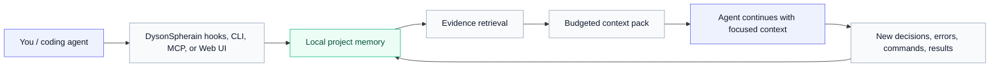
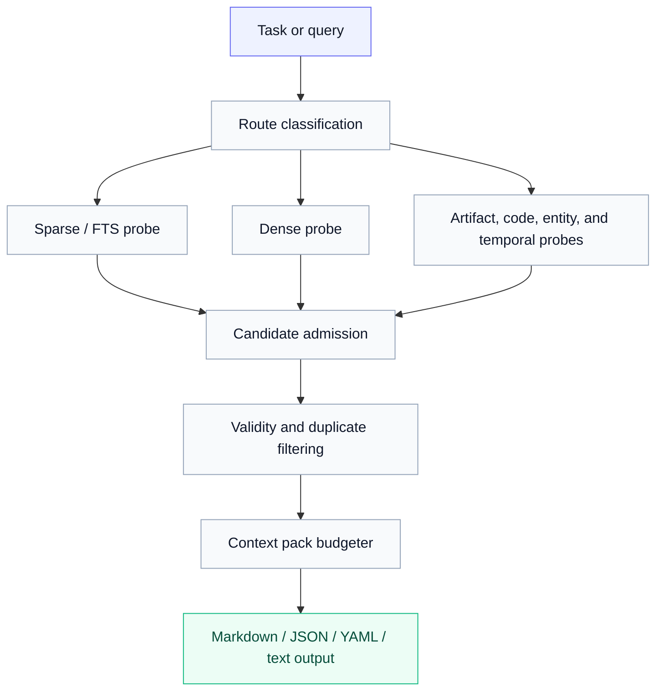

# DysonSpherain

<p align="center">
  <strong>Local-first memory OS for coding agents.</strong><br/>
  Give Codex, Claude Code, Gemini CLI, OpenCode, and MCP-capable tools a durable project memory — without pasting the same context again and again.
</p>

<p align="center">
  
  
  
  
  
</p>

---

## Why DysonSpherain?

Modern coding agents are powerful, but they forget the exact things that matter most: project decisions, failed attempts, benchmark results, constraints, errors, and why a previous implementation was rejected.

**DysonSpherain turns your repository into a long-horizon memory workspace.** It records useful project evidence locally, retrieves only the relevant pieces, and injects compact context packs into your agent workflow.

Instead of writing prompts like this every day:

> “Remember the previous benchmark regression, the config issue, the fallback embedding problem, the latest test command, the current design constraint, and the reason we changed retrieval fusion...”

You ask the agent to continue — and DysonSpherain provides the evidence.

---

## What you get at a glance

| You want... | DysonSpherain gives you... |
|---|---|
| Agents that remember long projects | Local project memory across sessions, windows, and tools |
| Less prompt repetition | Compact evidence packs instead of full chat history |
| Safer agent continuation | Decisions, constraints, errors, commands, and artifacts are stored as auditable evidence |
| Multi-agent compatibility | Codex, Claude Code hooks, Gemini CLI, OpenCode, and generic MCP tools |
| A usable interface | Local Web UI for search, timeline, benchmark lab, context composer, health checks, and settings |
| Control over data | `.memory/` local storage, `.dysonignore`, redaction, retention, export, and forget commands |
| Measurable efficiency | Token-economy reports estimate context saved by memory recall |

---

## The core idea



DysonSpherain is not just a vector search wrapper. It is a local memory layer built around **evidence**, **retrieval traces**, **context budgeting**, **runtime events**, **privacy controls**, and **agent integration**.

---

## 30-second start

### Option A — use the npm wrapper

```bash
npx dysonspherain-memory install --project .
npx dysonspherain-memory doctor --project .
npx dysonspherain-memory daemon --project . --port 37777
```

Then open:

```text
http://127.0.0.1:37777
```

### Option B — run from a cloned checkout

```bash
git clone <your-dysonspherain-repo-url>
cd DysonSpherain
node bin/dysonspherain-memory.js install --project .
node bin/dysonspherain-memory.js doctor --project .
node bin/dysonspherain-memory.js daemon --project . --port 37777
```

The wrapper prepares a package-local Python runtime when needed. Use `--no-bootstrap` or `DYSON_NO_BOOTSTRAP=1` if you prefer to manage Python dependencies yourself.

### Option C — Python development install

```bash
git clone <your-dysonspherain-repo-url>
cd DysonSpherain
python3 -m venv .venv
source .venv/bin/activate
pip install -e ".[full]"

dysonspherain init --project DysonSpherain
dysonspherain doctor --json
dysonspherain ui --project DysonSpherain --port 37777
```

Optional dependency groups:

| Extra | Purpose |
|---|---|
| `.[mcp]` | MCP SDK transport |
| `.[embedding]` | `sentence_transformers` semantic embeddings |
| `.[vector]` | Chroma vector backend |
| `.[full]` | Embedding + vector extras |
| `.[ui-test]` | Playwright UI tests |
| `.[encrypted]` | SQLCipher Python driver support |

---

## First useful commands

Record an important decision:

```bash
dysonspherain remember \
  --project DysonSpherain \
  --type decision \
  --text "Keep official benchmark profiles capped and artifact-backed."
```

Record a command and its output:

```bash
dysonspherain record \
  --project DysonSpherain \
  --source shell \
  --command "pytest tests/test_product_memory.py" \
  --capture-output
```

Search memory:

```bash
dysonspherain search "benchmark profile" --project DysonSpherain
```

Retrieve evidence with an auditable trace:

```bash
dysonspherain retrieve \
  "why did benchmark performance regress?" \
  --project DysonSpherain \
  --show-audit \
  --context-pack
```

Wake up a project after a long break:

```bash
dysonspherain wake \
  --project DysonSpherain \
  --task "resume benchmark regression repair" \
  --max-tokens 4000
```

Launch the local UI:

```bash
dysonspherain ui --project DysonSpherain --host 127.0.0.1 --port 37777
```

---

## Local Web UI

DysonSpherain includes a local cockpit for people who do not want to inspect SQLite files or CLI traces manually.

| Page | What it helps you do |
|---|---|
| Project Dashboard | See mission state, active constraints, resume context, and token savings |
| Memory Ledger | Review runtime events and saved-token rows |
| Situation Graph | Understand task, constraint, error, and regression relationships |
| Evidence Search | Search stored capsules and preview retrieval traces |
| Retrieval Trace Viewer | Inspect probes, filtered evidence, and final candidates |
| Evidence Timeline | Browse evidence in chronological order |
| Evidence Field Graph | Explore capsule relations and validity edges |
| Context Composer | Build task-specific memory packs with token budgets |
| Benchmark Lab | Track benchmark runs, artifacts, and regressions |
| Health Doctor | Check store, index, privacy, runtime, and integration health |
| Maintenance | Rebuild indexes and apply or dismiss duplicate/stale suggestions |
| Settings | Configure runtime and privacy behavior |

```bash
dysonspherain ui --project DysonSpherain --port 37777
```

---

## Agent integrations

DysonSpherain is designed to sit beside your coding agents rather than replace them.

| Agent / platform | Integration path |
|---|---|
| Codex | MCP config generation and `AGENTS.md` memory instructions |
| Claude Code | Session start, prompt submit, tool use, stop, session end, and post-compact hooks |
| Gemini CLI | Plugin manifest support |
| OpenCode | Plugin manifest support |
| Any MCP-capable tool | MCP server exposing recall, write, search, context pack, and health tools |

Install common integrations:

```bash
npx dysonspherain-memory install --project .
```

Install plugin manifests only:

```bash
npx dysonspherain-memory plugin install --project .
npx dysonspherain-memory plugin print
```

Start the MCP/local daemon path:

```bash
npx dysonspherain-memory daemon --project . --port 37777
```

Install user-level supervisor configs:

```bash
npx dysonspherain-memory supervisor install --project . --activate
npx dysonspherain-memory supervisor status --project .
```

---

## What DysonSpherain remembers

DysonSpherain stores project evidence as local capsules and traces, including:

- architectural decisions
- task summaries and continuation packets
- shell commands and captured outputs
- benchmark runs and metrics artifacts
- runtime events and lifecycle transitions
- errors, regressions, and recovery notes
- files, markdown imports, and external artifacts
- aliases, supersession, contradiction, deprecation, and validity state
- retrieval traces and generated context packs
- token-economy measurements

Memory is written under `.memory/` in your project workspace by default.

---

## Privacy by default

DysonSpherain is local-first.

| Control | Support |
|---|---|
| Local storage | Project memory is stored under `.memory/` |
| Ignore rules | `.dysonignore` plus default ignores for secrets, credentials, virtualenvs, `node_modules`, and `.git` |
| Redaction | Sensitive patterns are sanitized before durable writes |
| Forget/export | Soft forget, hard forget, retention policies, and export manifests |
| Encryption path | External/OS-managed marker support and optional SQLCipher migration |
| Auditability | Retrieval traces show why evidence was selected or filtered |

Useful commands:

```bash
dysonspherain export --project DysonSpherain --format json
dysonspherain forget --capsule-id cap_xxx --project DysonSpherain
dysonspherain index configure-encryption external_or_os_managed --scope project_volume
dysonspherain index configure-encryption sqlcipher --key-env DYSON_MEMORY_SQLCIPHER_KEY --allow-unavailable
```

---

## Token economy

DysonSpherain estimates how many tokens are saved when a compact memory pack replaces a larger prompt history.

```text
estimated_saved_tokens = max(0, baseline_context_tokens - injected_tokens)
saving_ratio = estimated_saved_tokens / max(1, baseline_context_tokens)
```

Token-economy summaries are available through the CLI, daemon API, Web UI, and benchmark artifact reports.

```bash
dysonspherain evaluate-token-economy --help
dysonspherain token-economy-final-report --help
```

---

## Retrieval and context system

DysonSpherain combines multiple retrieval paths to produce compact, traceable context.



Dense retrieval supports two scale modes:

| Mode | Use case |
|---|---|
| SQLite inline vectors | Dependency-light default for local use |
| Chroma ANN index | Larger product-memory stores and faster vector search |

Configure retrieval backends:

```bash
dysonspherain index embedding-backends --project DysonSpherain
dysonspherain index configure-embedding local_hash_embedding
dysonspherain index configure-embedding sentence_transformers \
  --model sentence-transformers/all-MiniLM-L6-v2 \
  --allow-unavailable

dysonspherain index vector-backends --project DysonSpherain
dysonspherain index configure-vector sqlite_inline
dysonspherain index configure-vector chroma --allow-unavailable
dysonspherain index rebuild-vector --project DysonSpherain
```

---

## MCP tools

The MCP server exposes memory tools that agents can call directly.

| Tool | Purpose |
|---|---|
| `dyson_memory_intent` | Decide whether memory should be used and suggest a token budget |
| `dyson_recall` | Retrieve compact evidence for a query |
| `dyson_context_pack` | Build a budgeted context pack |
| `dyson_write_memory` | Write sanitized memory with dedupe |
| `dyson_search_memory` | Search observation records |
| `dyson_timeline` | Inspect related events around an observation/session |
| `dyson_get_observations` | Fetch observation details |
| `dyson_resume_context` | Reconstruct continuation context for a new window/session |
| `dyson_product_write` | Write a product evidence capsule |
| `dyson_product_search` | Search product capsules with retrieval trace support |
| `dyson_product_retrieve` | Retrieve product evidence and optionally build a context pack |
| `dyson_product_wake` | Build a task wake-up context pack |
| `dyson_product_inspect` | Inspect a capsule by id |
| `dyson_product_update_validity` | Supersede, deprecate, contradict, or revert evidence |
| `dyson_product_context_pack` | Build a product context pack |
| `dyson_health_doctor` | Run product health checks |

Smoke-test the MCP path:

```bash
npx dysonspherain-memory mcp-smoke
```

---

## Local API

When the daemon is running, these endpoints are available locally:

| Endpoint | Purpose |
|---|---|
| `GET /api/health` | Service and product-memory health |
| `GET /api/token-economy` | Saved-token summaries and rows |
| `GET /api/resume-context` | Compact continuation packet |
| `GET /api/capsules` | List product evidence capsules |
| `POST /api/retrieve` | Retrieve evidence with trace and optional context pack |
| `POST /api/context-pack` | Build a budgeted context pack |
| `GET /api/maintenance` | List duplicate/stale benchmark suggestions |
| `POST /api/index/rebuild` | Rebuild embeddings and product vector index |
| `GET /api/index/embedding-backends` | Inspect embedding backend availability |
| `GET /api/index/vector-backends` | Inspect vector backend availability |
| `POST /api/index/configure-vector` | Configure SQLite inline or Chroma backend |
| `POST /api/index/rebuild-vector` | Rebuild the optional Chroma product ANN index |

---

## Benchmark and validation snapshot

The repository tracks benchmark artifacts and smoke checks so memory behavior can be evaluated instead of only described.

Latest local full-run artifact snapshot included in the current project materials:

| Benchmark | Questions | Time | Final R@10 | Final NDCG@10 | Candidate R@100 |
|---|---:|---:|---:|---:|---:|
| LongMemEval | 500 | 2m 06s | 0.9778 | 0.9259 | 1.0000 |
| LoCoMo | 1,986 | 4m 17s | 0.9067 | 0.7531 | 1.0000 |
| KnowMe official/formal | 1,010 | 8m 21s | 0.5983 | 0.5047 | 0.7245 |
| CloneMem | 2,374 | 18m 47s | 0.0953 | 0.0750 | 0.3438 |
| ConvoMem | 1,986 | 2m 35s | n/a | n/a | n/a |

ConvoMem currently records a conversation-memory runtime artifact rather than the same retrieval metrics. Full benchmark datasets are not bundled with the repository.

Run product smoke checks:

```bash
python scripts/product_acceptance_smoke.py --output reports/product_acceptance_smoke.json
```

Focused tests:

```bash
python -m pytest \
  tests/test_product_acceptance_smoke.py \
  tests/test_product_memory.py \
  tests/test_daemon_api.py \
  tests/test_mcp_server.py \
  tests/test_npm_wrapper.py \
  tests/test_codex_config_generation.py -q
```

Optional UI and vector validation:

```bash
python -m pip install -e ".[ui-test]"
python -m playwright install chromium
python -m pytest tests/test_product_ui_playwright.py -q

python -m pip install -e ".[full]"
python -m pytest tests/test_product_chroma_vector.py -q
```

---

## Repository layout

```text
.
├── base/
│   ├── sphere_cli/                 # CLI, retrieval, storage, config, runtime
│   └── dysonspherain/
│       ├── adapters/               # MCP, Claude hooks, daemon, supervisor
│       ├── product/                # Product evidence store and retrieval
│       ├── memory_os/              # Observations, resume context, token economy
│       └── memory_runtime/         # Ledger, situation graph, scheduler
├── bin/                            # npm wrapper entrypoint
├── docs/                           # Product, API, privacy, integration notes
├── scripts/                        # Smoke, reports, evaluation utilities
├── tests/                          # Product, adapter, runtime, benchmark tests
├── web/                            # Optional frontend assets
├── .codex-plugin/                  # Codex plugin manifest
├── .claude-plugin/                 # Claude plugin manifest
├── .gemini/                        # Gemini CLI manifest
├── .opencode/                      # OpenCode manifest
├── .github/workflows/product.yml   # Product CI lanes
├── package.json                    # npm quick-start wrapper
└── pyproject.toml                  # Python package metadata
```

---

## Operational notes

- Product memory and benchmark retrieval are separate unless a runner explicitly calls product APIs.
- Token savings are estimates from recorded token fields, not billing invoices.
- SQLite inline vectors are dependency-light; Chroma is recommended for larger product stores.
- SQLCipher support requires optional dependencies and an operator-provided key.
- Full benchmark datasets are not included in the repository.

---

## License

GNU General Public License v3.0 or later (`GPL-3.0-or-later`).
