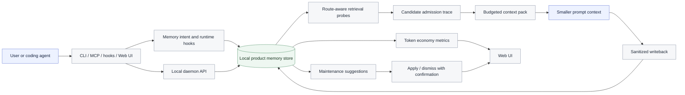
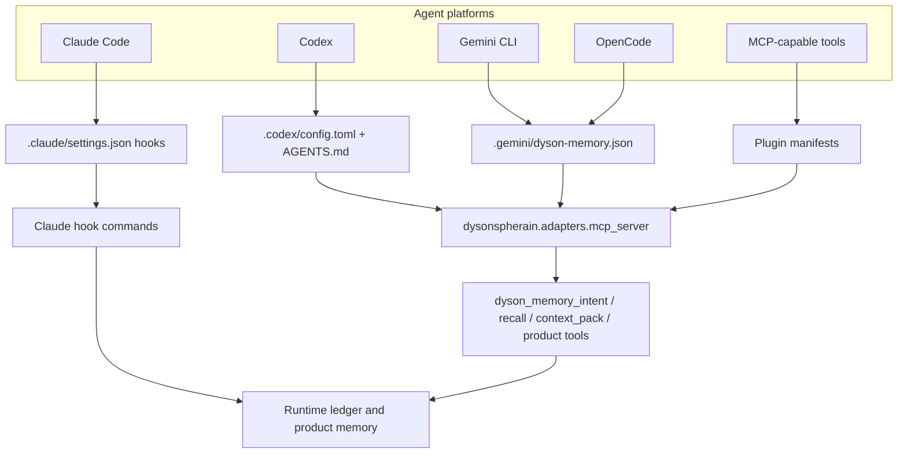
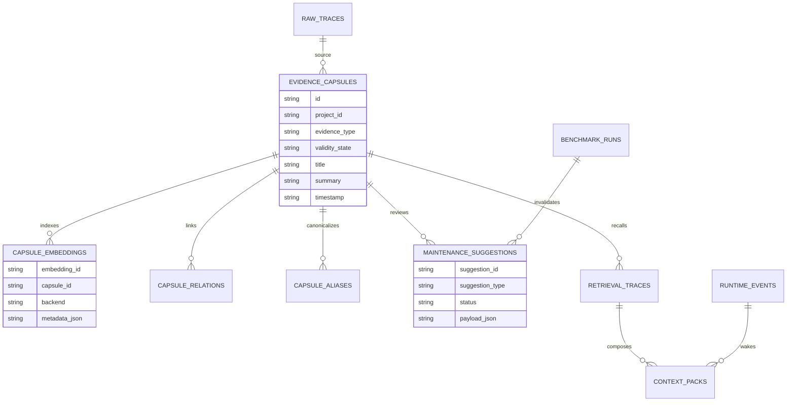
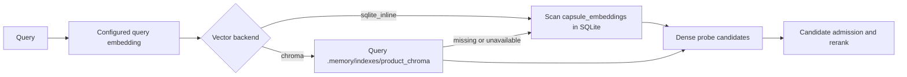
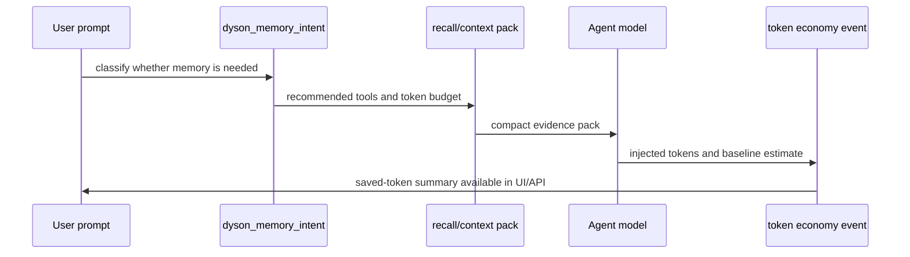

# DysonSpherain

> Local-first long-horizon memory, context recall, and token-economy tooling for coding agents.

DysonSpherain gives agent workflows a durable project memory layer. It captures
decisions, observations, benchmark results, runtime events, files, traces, and
task state locally, then recalls compact evidence packs instead of asking you to
paste the same background into every new prompt.

The current codebase is no longer just a CLI. It ships as:

- **Python CLI** for product memory, retrieval, context packs, lifecycle events,
  benchmark lab records, maintenance, privacy, and index management.
- **Local Web UI and HTTP API** served by the built-in daemon.
- **MCP server** for Codex, Claude, Gemini CLI, OpenCode, and other MCP-capable
  tools.
- **Claude hooks** for session start, prompt submission, tool use, stop,
  session end, and post-compact events.
- **npm/npx wrapper** for quick start, plugin install, daemon launch, and
  user-level supervisor installation.
- **Product evidence store** with SQLite, FTS5, dense probe, configurable
  embeddings, optional Chroma ANN indexing, retention/export/delete, and
  maintenance review flows.

## Capability Map

| Area | Current support |
|---|---|
| Agent setup | Codex MCP config, Claude hooks, Codex/Claude plugin manifests, Gemini CLI and OpenCode manifests |
| Memory store | Local `.memory/dyson_product.sqlite3` with raw traces, evidence capsules, retrieval traces, context packs, runtime events, benchmark runs, aliases, and maintenance suggestions |
| Retrieval | Sparse/FTS, dense probe, artifact/code/entity/temporal probes, route classification, admission trace, validity filtering |
| Context recall | Resume context, product wake/context packs, section budgets, markdown/json/yaml/text rendering |
| Token economy | Per-event saved-token estimates, 24h/7d/30d summaries, Web UI display, benchmark artifact reporting |
| Scale path | SQLite inline vectors by default; optional `sentence_transformers` embeddings and Chroma ANN product vector index |
| Privacy | `.dysonignore`, redaction before write, retention, export, soft/hard forget, external encryption marker, optional SQLCipher migration |
| Operations | Health doctor, index rebuild/repair, maintenance apply/dismiss, launchd/systemd user supervisor templates |

## Architecture





## Quick Start

### npx / npm wrapper

Use this when the package is installed from npm or from this checkout:

```bash
npx dysonspherain-memory install --project .
npx dysonspherain-memory doctor --project .
```

Persistent command:

```bash
npm install -g dysonspherain-memory
dyson-memory install --project .
dyson-memory doctor --project .
```

Plugin manifests only:

```bash
npx dysonspherain-memory plugin install --project .
npx dysonspherain-memory plugin print
```

Start the local daemon through the wrapper:

```bash
npx dysonspherain-memory daemon --project . --port 37777
```

Install user-level supervisor configs:

```bash
npx dysonspherain-memory supervisor install --project . --activate
npx dysonspherain-memory supervisor status --project .
```

The wrapper bootstraps a package-local Python environment when the selected
Python cannot import DysonSpherain. Use `--no-bootstrap` or
`DYSON_NO_BOOTSTRAP=1` to manage Python dependencies yourself.

### Python development install

```bash
# From this repository checkout:
cd DysonSpherain

python3 -m venv .venv
source .venv/bin/activate
pip install -e ".[full]"

dysonspherain init --project DysonSpherain
dysonspherain doctor --json
```

Optional extras:

| Extra | Purpose |
|---|---|
| `.[mcp]` | MCP SDK transport |
| `.[embedding]` | `sentence_transformers` semantic embeddings |
| `.[vector]` | Chroma vector backend |
| `.[full]` | Vector + embedding extras |
| `.[ui-test]` | Playwright UI interaction tests |
| `.[encrypted]` | SQLCipher Python driver support |

## Product CLI

Common product commands:

```bash
dysonspherain init --project DysonSpherain
dysonspherain remember --project DysonSpherain --type decision --text "Keep official benchmark profiles capped."
dysonspherain record --project DysonSpherain --source shell --command "pytest tests/test_product_memory.py" --capture-output
dysonspherain import markdown session.md --project DysonSpherain
dysonspherain search "benchmark profile" --project DysonSpherain
dysonspherain retrieve "benchmark profile" --project DysonSpherain --show-audit --context-pack
dysonspherain wake --project DysonSpherain --task "resume benchmark repair" --max-tokens 4000
dysonspherain inspect cap_xxx --project DysonSpherain
dysonspherain forget --capsule-id cap_xxx --project DysonSpherain
dysonspherain export --project DysonSpherain --format json
dysonspherain benchmark-lab record --project DysonSpherain --artifact BenchmarkResult/latest/metrics.json
dysonspherain ui --project DysonSpherain --port 37777
```

Runtime hook commands:

```bash
dysonspherain runtime before-task --project DysonSpherain --task "run KnowMe official profile"
dysonspherain runtime on-error --project DysonSpherain --error-file traceback.txt
dysonspherain runtime after-task --project DysonSpherain --summary "KnowMe rerun completed"
dysonspherain runtime pre-compact --project DysonSpherain
dysonspherain runtime after-benchmark --project DysonSpherain --metrics metrics.json
```

Index, maintenance, and privacy commands:

```bash
dysonspherain index verify --project DysonSpherain
dysonspherain index rebuild --project DysonSpherain
dysonspherain index repair --project DysonSpherain

dysonspherain index embedding-backends --project DysonSpherain
dysonspherain index configure-embedding local_hash_embedding
dysonspherain index configure-embedding sentence_transformers --model sentence-transformers/all-MiniLM-L6-v2 --allow-unavailable

dysonspherain index vector-backends --project DysonSpherain
dysonspherain index configure-vector sqlite_inline
dysonspherain index configure-vector chroma --allow-unavailable
dysonspherain index rebuild-vector --project DysonSpherain

dysonspherain index maintenance --project DysonSpherain
dysonspherain index maintenance --project DysonSpherain --apply sug_xxx --canonical-id cap_xxx
dysonspherain index maintenance --project DysonSpherain --dismiss sug_xxx --reason "not a duplicate"

dysonspherain index configure-encryption external_or_os_managed --scope project_volume
dysonspherain index configure-encryption sqlcipher --key-env DYSON_MEMORY_SQLCIPHER_KEY --allow-unavailable
dysonspherain index migrate-sqlcipher --key-env DYSON_MEMORY_SQLCIPHER_KEY
dysonspherain index migrate-sqlcipher --key-env DYSON_MEMORY_SQLCIPHER_KEY --replace
```

## Web UI And Local API

Start the built-in local UI:

```bash
dysonspherain ui --project DysonSpherain --host 127.0.0.1 --port 37777
```

Open:

```text
http://127.0.0.1:37777
```

Current UI pages:

| Page | Purpose |
|---|---|
| Project Dashboard | Mission state, active constraints, resume context, token savings |
| Memory Ledger | Runtime events and token-savings rows |
| Situation Graph | Event-sourced task/constraint/regression graph |
| Evidence Search | Capsule search and retrieval trace preview |
| Retrieval Trace Viewer | Probe counts, final candidates, filtered evidence |
| Evidence Timeline | Time-ordered evidence capsules |
| Evidence Field Graph | Capsule relations and validity edges |
| Context Composer | Build task-specific context packs |
| Benchmark Lab | Benchmark run and regression artifact dashboard |
| Health Doctor | Store/index/privacy/runtime health checks |
| Maintenance | Rebuild indexes, configure embedding/vector backends, apply/dismiss suggestions |
| Settings | Runtime and privacy configuration |

Useful API endpoints:

| Endpoint | Purpose |
|---|---|
| `GET /api/health` | Local service and product memory health |
| `GET /api/token-economy` | Saved-token summaries and event rows |
| `GET /api/resume-context` | Compact continuation packet |
| `GET /api/capsules` | List product evidence capsules |
| `POST /api/retrieve` | Retrieve evidence with admission trace and optional context pack |
| `POST /api/context-pack` | Build a budgeted context pack |
| `GET /api/maintenance` | List duplicate/stale benchmark suggestions |
| `POST /api/index/rebuild` | Rebuild embeddings and product vector index |
| `GET /api/index/embedding-backends` | Inspect embedding backend availability |
| `GET /api/index/vector-backends` | Inspect vector backend availability |
| `POST /api/index/configure-vector` | Configure SQLite inline or Chroma product vector backend |
| `POST /api/index/rebuild-vector` | Rebuild the optional Chroma product ANN index |

## Memory And Index Model



Dense retrieval has two scale modes:



## Agent And MCP Tools

The MCP server exposes legacy observation tools and product evidence tools.

Core memory tools:

| Tool | Use |
|---|---|
| `dyson_memory_intent` | Decide whether memory should be called and recommend tools/budget |
| `dyson_recall` | Retrieve compact evidence for a query |
| `dyson_context_pack` | Build a budgeted context pack |
| `dyson_write_memory` | Write sanitized memory with dedupe |
| `dyson_search_memory` | Search observation records |
| `dyson_timeline` | Inspect related events around an observation/session |
| `dyson_get_observations` | Fetch observation details |
| `dyson_resume_context` | Reconstruct continuation context for a new window/session |

Product evidence tools:

| Tool | Use |
|---|---|
| `dyson_product_write` | Write a product evidence capsule |
| `dyson_product_search` | Search product capsules with retrieval trace support |
| `dyson_product_retrieve` | Retrieve product evidence and optionally build a context pack |
| `dyson_product_wake` | Build a task wake-up context pack |
| `dyson_product_inspect` | Inspect a capsule by id |
| `dyson_product_update_validity` | Supersede, deprecate, contradict, or revert evidence |
| `dyson_product_context_pack` | Build a product context pack |
| `dyson_health_doctor` | Run product health checks |

## Token Economy

DysonSpherain tracks estimated savings when a compact memory pack replaces a
larger prompt history:

```text
estimated_saved_tokens = max(0, baseline_context_tokens - injected_tokens)
saving_ratio = estimated_saved_tokens / max(1, baseline_context_tokens)
```

The daemon API and UI show per-conversation savings plus rolling 24h, 7d, and
30d totals. Benchmark runners and token-economy evaluators can also write
per-sample and summary artifacts.



## Privacy And Retention

- Local-first storage under `.memory/`.
- `.dysonignore` plus default ignore patterns for secrets, credentials,
  virtualenvs, `node_modules`, and `.git`.
- Redaction before durable writes.
- Soft forget, hard forget, retention by date/count, and export manifests.
- External/OS-managed encryption marker support.
- Optional SQLCipher migration when `pysqlcipher3` and
  `DYSON_MEMORY_SQLCIPHER_KEY` are available.

## Validation

Benchmark snapshot from the latest local full-run artifacts:

| Benchmark | Questions | Time | Final R@10 | Final NDCG@10 | Candidate R@100 |
|---|---:|---:|---:|---:|---:|
| LongMemEval | 500 | 2m 06s | 0.9778 | 0.9259 | 1.0000 |
| LoCoMo | 1,986 | 4m 17s | 0.9067 | 0.7531 | 1.0000 |
| KnowMe official/formal | 1,010 | 8m 21s | 0.5983 | 0.5047 | 0.7245 |
| CloneMem | 2,374 | 18m 47s | 0.0953 | 0.0750 | 0.3438 |
| ConvoMem | 1,986 | 2m 35s | n/a | n/a | n/a |

Sources: `BenchmarkResult/full_trend_other_benchmarks_20260501_015200`,
`BenchmarkResult/knowme_official_formal_full_20260501_011900`, and
`reports/formal_protocol_validation.md`. ConvoMem currently records a
conversation-memory runtime artifact rather than the same retrieval metrics.

Product smoke:

```bash
python scripts/product_acceptance_smoke.py --output reports/product_acceptance_smoke.json
```

Focused product tests:

```bash
python -m pytest \
  tests/test_product_acceptance_smoke.py \
  tests/test_product_memory.py \
  tests/test_daemon_api.py \
  tests/test_mcp_server.py \
  tests/test_npm_wrapper.py \
  tests/test_codex_config_generation.py -q
```

Optional UI and Chroma validation:

```bash
python -m pip install -e ".[ui-test]"
python -m playwright install chromium
python -m pytest tests/test_product_ui_playwright.py -q

python -m pip install -e ".[full]"
python -m pytest tests/test_product_chroma_vector.py -q
```

The repository includes a GitHub Actions workflow at
`.github/workflows/product.yml` with a product smoke/UI lane and a Chroma-backed
vector lane.

Recent product smoke checks include:

| Check | Meaning |
|---|---|
| `dense_probe_available` | Product dense probe returns candidates |
| `embedding_backend_registry` | Embedding backend registry/config works |
| `vector_backend_registry` | SQLite/Chroma vector backend registry works |
| `maintenance_apply` | Duplicate/stale suggestions can be applied |
| `encryption_status_reported` | Privacy API reports encryption state |
| `retrieval_trace_saved` | Retrieval writes an auditable trace |
| `wake_context_pack` | Context pack generation works |

## Repository Layout

```text
.
├── base/
│   ├── sphere_cli/                 # CLI, retrieval, storage, config, runtime
│   └── dysonspherain/
│       ├── adapters/               # MCP, Claude hooks, daemon, supervisor
│       ├── product/                # Product evidence store and retrieval
│       ├── memory_os/              # Observations, resume context, token economy
│       └── memory_runtime/         # Ledger, situation graph, scheduler
├── bin/                            # npm wrapper entrypoint
├── docs/                           # Product, API, privacy, integration notes
├── scripts/                        # Smoke, reports, evaluation utilities
├── tests/                          # Product, adapter, runtime, benchmark tests
├── web/                            # Optional Next.js frontend assets
├── .codex-plugin/                  # Codex plugin manifest
├── .claude-plugin/                 # Claude plugin manifest
├── .github/workflows/product.yml   # Product CI lanes
├── package.json                    # npm quick-start wrapper
└── pyproject.toml                  # Python package metadata
```

## Boundaries

- Product memory and benchmark retrieval are currently separate unless a runner
  explicitly calls product APIs.
- Token savings are estimates from recorded token fields, not billing invoices.
- SQLite inline vectors are dependency-free; Chroma is recommended for larger
  product stores.
- SQLCipher support requires optional dependencies and an operator-provided key.
- Full benchmark datasets are not bundled with the repository.

## License

GNU General Public License v3.0 or later (`GPL-3.0-or-later`).
